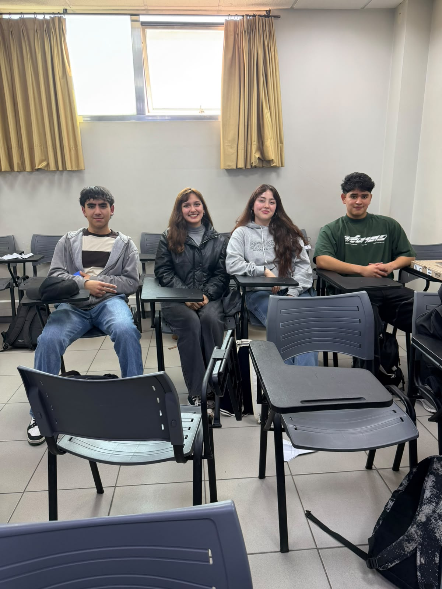

# S01 - Identidad del equipo y desafío

**Fecha:** 27-08-2026  
**Participantes:** Martina Pérez, María Ignacia Pino, Juan Pérez, Bastián Cárcamo  
**Lugar o modalidad:** Presencial, Sala de estudios  

## Objetivo de la sesión

Construir la identidad del equipo, acordar su forma de trabajo y realizar una primera interpretación del desafío Capstone.

## Foto del equipo

## Nombre del equipo

**Nombre:** UPCYLAB

**¿Por qué lo elegimos?**  
Surge de la combinación de las palabras "Upcycling" (suprarreciclaje) y "Lab" (laboratorio). Refleja nuestro enfoque en la experimentación y en darle un nuevo y mayor valor a los residuos de fabricación digital que actualmente se consideran desechos, transformando el problema en una oportunidad.

## Integrantes y roles iniciales

| Integrante | Carrera o especialidad | Rol inicial | Aporte esperado |
|---|---|---|---|
| María Ignacia Pino | Ing. Civil en Computación e Informática | Coordinadora de reuniones y documentación | Liderar sesiones semanales, alinear al equipo y registrar acuerdos en Google Docs. |
| Martina Pérez | Ing. Civil en Computación e Informática | Investigadora y referente de innovación | Explorar soluciones existentes, referentes y nutrir el proceso de ideación con evidencia. |
| Juan Pérez | Ing. Civil en Computación e Informática | Gestor del repositorio y versiones | Mantener GitHub organizado, documentando cada avance y reflejando el proceso de trabajo. |
| Bastián Cárcamo | Ing. Civil en Computación e Informática | Coordinador de comunicaciones y agenda | Gestionar comunicación (WhatsApp) y organizar agenda asegurando fluidez e información. |

## Valores del equipo

- **Responsabilidad ambiental:** Cada decisión que tomemos considera su impacto en el medioambiente.
- **Respeto:** Valoramos las ideas, opiniones y tiempos de cada integrante.
- **Compromiso:** Nos involucramos de forma activa y constante en cada etapa del proyecto.
- **Creatividad:** Buscamos soluciones innovadoras frente a los desafíos.
- **Honestidad:** Comunicamos de manera transparente nuestros avances, dificultades y opiniones.
- **Colaboración:** Apoyamos y complementamos el trabajo de cada integrante.

## Normas y contrato de funcionamiento

1. **Canal y frecuencia de comunicación:** Uso de WhatsApp para coordinación diaria ágil y reuniones presenciales 2 a 3 veces por semana según disponibilidad.
2. **Puntualidad y asistencia:** Asistir puntualmente a las reuniones o avisar con al menos 48h de anticipación en caso de no poder asistir.
3. **Distribución y seguimiento de tareas:** Asignación colectiva en reuniones semanales y seguimiento de cumplimiento mediante actas en Google Docs.
4. **Forma de tomar decisiones:** De manera colectiva y participativa; ninguna decisión se tomará de forma unilateral por un solo integrante.
5. **Forma de resolver conflictos:** Diálogo interno primero; si no se logra resolver, se escalará a la docente líder (Ana Jorquera).
6. **Responsabilidad de actualizar GitHub:** Compromiso de realizar commits documentados semanalmente y tras cada avance significativo del proyecto.

## Primera definición del desafío

El equipo entiende el desafío como la necesidad de diseñar un prototipo técnicamente viable que permita reducir, reutilizar o reciclar los residuos de impresión 3D en resina y los generados por la cortadora láser en los laboratorios de fabricación digital, dándoles una segunda vida útil y ética.

### Lo que sabemos

- Los residuos de PLA (Ácido Poliláctico) ya cuentan con un circuito de reciclaje gestionado a través de un convenio con REBASE.
- Los residuos de resina y materiales de corte láser carecen de una gestión adecuada actualmente y representan una dificultad mayor.

### Lo que todavía no sabemos

- ¿Cuál es el volumen mensual exacto (en kg o litros) de residuos de resina y corte láser que se genera en el laboratorio?
- ¿Cuáles son las restricciones de bioseguridad y normativas de toxicidad asociadas a la manipulación de resinas no curadas?

### Supuestos que debemos comprobar

- Suponemos que la comunidad del laboratorio está dispuesta a clasificar estos desechos si instalamos contenedores específicos.
- Suponemos que es posible procesar el material de descarte (como restos de acrílico/MDF de la cortadora) sin necesidad de maquinaria industrial externa.

## Objetivo SMART del equipo

Diseñar, prototipar y documentar (en GitHub) una solución técnicamente viable para la revalorización o reducción de residuos de resina o corte láser en el laboratorio de fabricación digital, entregando un MVP (Producto Mínimo Viable) funcional y evaluado para la última semana del semestre académico actual.

## Compromisos individuales SMART

| Integrante | Compromiso | Evidencia de cumplimiento | Fecha |
|---|---|---|---|
| María Ignacia Pino | Liderar 1 reunión de seguimiento/semana y documentar en Docs en 24h. | Actas publicadas en la carpeta compartida | Semanal |
| Bastián Cárcamo | Responder WhatsApp en <24h y coordinar reuniones con 48h de anticipación. | Registro de mensajes y calendario de equipo | Continuo |
| Martina Pérez | Presentar 2 referentes de soluciones de residuos (resina/láser). | Documento de investigación/Pitch al equipo | 10-09-2026 |
| Juan Pérez | Realizar al menos un commit documentado por semana. | Historial de commits en el repositorio | Semanal |

## Acuerdos y tareas

| Tarea | Responsable(s) | Fecha límite | Estado |
|---|---|---|---|
| Configurar la estructura inicial del repositorio en GitHub | Juan Pérez | 01-09-2026 | Pendiente |
| Agendar entrevista con el encargado del laboratorio para medir residuos | Bastián Cárcamo | 03-09-2026 | Pendiente |
| Iniciar búsqueda de referentes de reciclaje de resina 3D | Martina Pérez | 05-09-2026 | Pendiente |

## Reflexión breve

**¿Qué fue fácil?**  
Acordar los valores y normas de convivencia, ya que el equipo comparte una visión común sobre la responsabilidad ambiental y la importancia de la puntualidad y el respeto mutuo.

**¿Qué fue difícil o generó desacuerdo?**  
Definir si nos enfocaríamos en resina o cortadora láser inmediatamente. Hubo debate sobre cuál de los dos problemas es más urgente, por lo que decidimos mantener ambos en el radar hasta investigar más.

**¿Qué necesitamos resolver en la próxima sesión?**  
Necesitamos revisar la información preliminar sobre los volúmenes de generación de ambos tipos de residuos para elegir un único foco (resina o láser) que sea viable de abordar durante este semestre.
