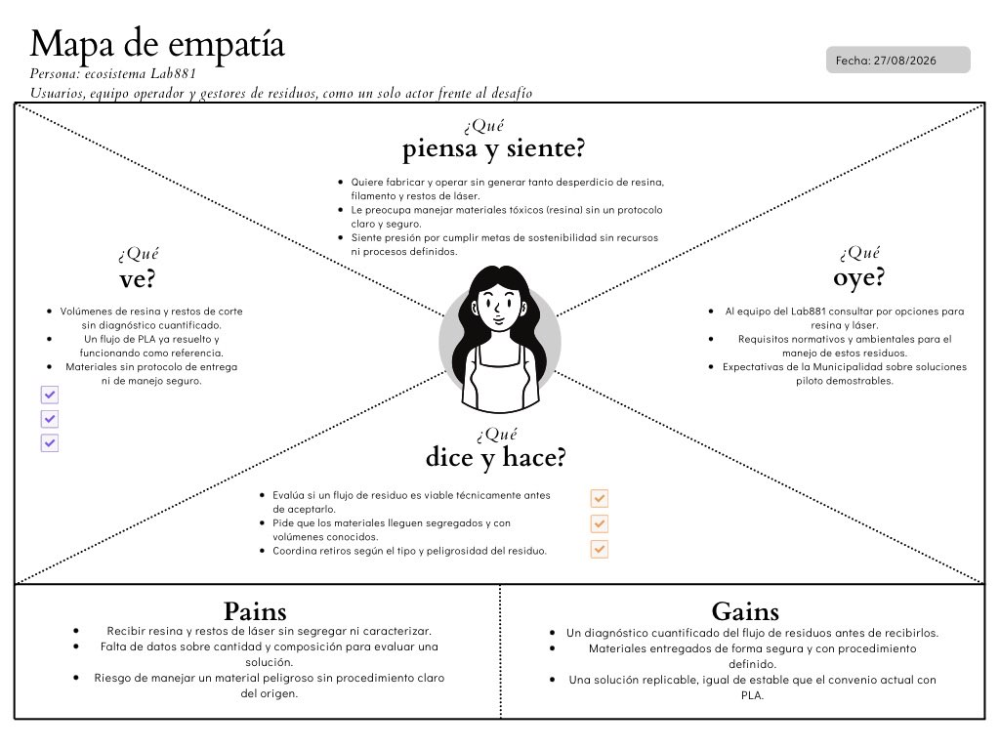

# S03 - Elaboración de Mapa Conceptual y Mapa de Empatía

**Fecha:** 27-08-2026  
**Participantes:** Martina Pérez, María Ignacia Pino, Juan Pérez, Bastián Cárcamo  
**Responsable del registro:** María Ignacia Pino

## Objetivo

Comprender la problemática de residuos de fabricación digital en el Lab881, analizando las relaciones causa-efecto del sistema y caracterizando las necesidades, dolores y expectativas del ecosistema del laboratorio (usuarios, equipo operador y gestores).

## Actividades realizadas

1. Elaboración del mapa conceptual del desafío de circularidad y manejo de residuos en el Lab881.
2. Construcción del mapa de empatía del ecosistema Lab881 (actores, gestores de residuos y usuarios).
3. Sistematización de requerimientos, limitaciones técnicas y oportunidades de valorización para residuos de resina y cortadora láser.

## Evidencias

  
  

- [Ver todos los diagramas en la carpeta Diagramas](./Diagramas)

## Resultados

- **Estructura del problema:** Se identificó que mientras el PLA cuenta con un convenio activo con REBASE, existen volúmenes no cuantificados ni segregados de resina y restos de corte láser que carecen de un protocolo de manejo seguro y valorización.
- **Caracterización del usuario/ecosistema:** El equipo del Lab881 presenta una alta disposición a cumplir metas de sostenibilidad, pero se ve limitado por la falta de procedimientos claros para manejar materiales potencialmente peligrosos (resina) sin diagnóstico de volúmenes o composición.

## Decisiones y justificación

| Decisión | Evidencia o criterio | Consecuencia para el proyecto |
|---|---|---|
| Enfocar el proyecto en residuos de resina y cortadora láser | El PLA ya cuenta con una solución activa mediante el convenio con REBASE. | Se descarta el PLA para priorizar los materiales sin protocolo ni alternativa de reciclaje. |
| Exigir diagnóstico y segregación en origen | Los gestores (Pains) señalan el riesgo de recibir material sin caracterizar ni volumen conocido. | Se deberá diseñar un protocolo de entrega y caracterización de residuos previo a la recolección. |
| Replicar el modelo de convenio existente | Éxito previo del manejo de PLA en la institución (Gains del mapa de empatía). | La solución propuesta debe ofrecer la misma estabilidad normativa y operativa que el convenio actual. |

## Errores, dificultades o riesgos

- **Inexistencia de datos cuantitativos:** No se cuenta con registros exactos sobre el volumen de residuos de resina ni de cortes de láser generados por período.
- **Riesgo de manipulación:** Riesgo operativo al gestionar resina no curada sin protocolos de seguridad química definidos.
- **Resistencia al cambio:** Posible falta de segregación correcta en origen por parte de los estudiantes y usuarios del laboratorio.

## Aprendizajes

- El problema no es solo la falta de reciclaje, sino la ausencia de una etapa previa de diagnóstico, caracterización de peligrosidad y protocolos de segregación en origen.
- Los gestores de residuos requieren seguridad normativa y volúmenes cuantificados antes de aceptar o evaluar la viabilidad técnica de un nuevo flujo de material.

## Tareas y responsables

| Tarea | Responsable(s) | Fecha límite | Estado |
|---|---|---|---|
| Cuantificar y caracterizar residuos de resina y corte láser | Juan Pérez | 11/09/2026 | Pendiente |
| Diseñar borrador de protocolo de segregación y seguridad | María Ignacia Pino | 11/09/2026 | Pendiente |
| Evaluar alternativas tecnológicas de valorización | Martina Pérez | 11/09/2026 | Pendiente |

## Próximo paso

Diseñar e implementar una herramienta o coordinar un canal de comunicación con el Lab881 para registrar el volumen y tipo de residuo de resina y corte generado durante una semana de operaciones.

## Fuentes consultadas

- Lab881 (2026), *Mapa Conceptual: Circularidad y Manejo de Residuos de Fabricación Digital*, Universidad Mayor.
- Ecosistema Lab881 (2026), *Mapa de Empatía: Usuarios, equipo operador y gestores de residuos*, Registro interno de investigación.
- Manglai. (2026, 23 de junio). ¿Qué es el upcycling? Definición, ejemplos y normativa. Manglai Glossary. https://www.manglai.io/glossary/upcycling
